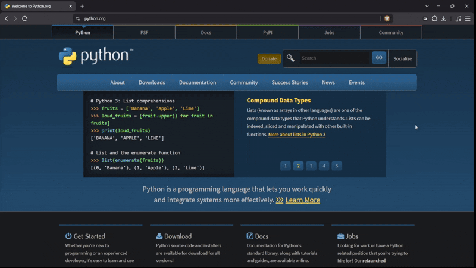

# Full Page Screenshoot

A high-performance Mozilla Firefox and Chromium browser extension designed for one-click, pixel-perfect full webpage screen captures. Built on native browser compositor APIs with automatic sequential scrolling, universal single-page application (SPA) container detection, and an integrated preview viewer featuring single-page and multi-page A4 PDF export, lossless PNG downloading, clipboard copying, and redaction tools (Gaussian Blur and Mosaic Censor).


<p align="center">
  
</p>

---

## Key Features

### 1. Native Compositor Capture Engine
- **100% Native Visual Fidelity**: Renders modern CSS Color Module 4 (`color(srgb ...)`, `oklch()`, `lab()`), WebGL, Canvas, custom typography, SVGs, and dynamic stylesheets without relying on fragile third-party DOM parsers.
- **Strict Rate-Limit Protection**: Enforces an optimized 520 ms pipelined capture interval with exponential backoff, preventing browser `MAX_CAPTURE_VISIBLE_TAB_CALLS_PER_SECOND` quota errors.
- **Dynamic Fixed Header Suppression**: Automatically detects and hides `position: fixed` and `position: sticky` elements on subsequent scroll slices to prevent visual duplication.
- **Invisible Scrollbars**: Hides browser scrollbars visually during capture without locking root overflow scrolling.

### 2. Universal Scroller & SPA Container Detection
- **Standard Document Mode**: Captures long websites (GitHub, documentation, news, portfolio sites) by coordinating document-level scrolling from `y = 0` to `scrollHeight`.
- **Nested Container Mode**: Automatically detects and scrolls internal containers in complex web applications:
  - **Google Docs**: Targets `.kix-appview-editor` / `.goog-scrollable-container` and triggers synthetic scroll events for virtualized canvas rendering.
  - **Gmail**: Detects email thread scrollable containers.
  - **Productivity SPAs**: Notion, Slack, Discord, Trello, and chat interfaces.
- **Container-Aware Cropping**: Clips slices to container boundaries, eliminating repeated sidebars and top toolbars.

### 3. Integrated Preview & Annotation Workspace
- **Interactive Redaction & Markup Tools**:
  - **Smooth Gaussian Blur (`G`)**: GPU-accelerated blur filter with edge margin padding for soft redaction.
  - **Pixelated Mosaic Censor (`M` / `B`)**: Classic pixelation block censor for masking sensitive text or credentials.
  - **Shapes & Drawing**: Rectangle Box (`R`), Arrow Pointer (`A`), Freehand Pen (`P`), Text Notes (`T`).
  - **Palette**: Monochrome and white palette (`#ffffff`, `#cbd5e1`, `#64748b`, `#0f172a`).
  - **History Management**: Multi-step undo (`Ctrl+Z`) and canvas clear.

### 4. Versatile Export Handlers
- **Lossless PNG Export**: Generates full-resolution PNG images with flattened annotation layers.
- **JPEG Export**: Configurable quality level.
- **Single-Page PDF**: Compliant standard PDF 1.4 containing the entire webpage in one continuous canvas stream.
- **Multi-Page A4 PDF**: Divides long screenshots into standard A4 pages with printable margins for documentation and printing.
- **Clipboard Copy**: Copies the full-resolution PNG directly to the system clipboard for immediate pasting.

---

## Directory Structure

```
full-page-screenshot/
├── manifest.json              # Manifest V3 extension configuration
├── PRIVACY.md                 # Chrome Web Store compliance & privacy policy
├── assets/
│   └── demo.gif               # Animated demonstration recording
├── background/
│   └── service-worker.js      # Background scheduler, rate limiting, and session persistence
├── content/
│   ├── content.js             # Universal scroller engine and DOM measurement
│   └── content.css            # Non-blocking scrollbar suppression styles
├── viewer/
│   ├── viewer.html            # Full-page preview workspace
│   ├── viewer.css             # Viewer interface styling
│   └── viewer.js              # Canvas stitching, Gaussian blur, PDF generator, and export
└── icons/
    ├── icon16.png
    ├── icon32.png
    ├── icon48.png
    └── icon128.png
```

---

## Installation & Setup

### Mozilla Firefox
1. Open Firefox and navigate to `about:debugging#/runtime/this-firefox`.
2. Click **Load Temporary Add-on...**.
3. Select the `manifest.json` file inside the extension directory.
4. The extension icon will appear in your browser toolbar ready for one-click capture.

### Chromium / Brave / Google Chrome
1. Open your Chromium-based browser (Brave, Google Chrome, Microsoft Edge).
2. Navigate to `brave://extensions` (or `chrome://extensions`).
3. Enable the **Developer mode** toggle in the top right corner.
4. Click **Load unpacked** and select the repository directory.
5. The extension icon will appear in your browser toolbar ready for one-click capture.

---

## Usage

1. Open any webpage or document (e.g. GitHub repository, Google Docs, Gmail thread).
2. Click the **Full Page Screenshoot** icon in the browser toolbar.
3. The extension will automatically scroll and capture all slices.
4. A new preview tab will open with the screenshot copied to your clipboard, offering zoom, redaction tools, and export options (PNG, Single-Page PDF, Multi-Page A4 PDF, Copy to Clipboard).
